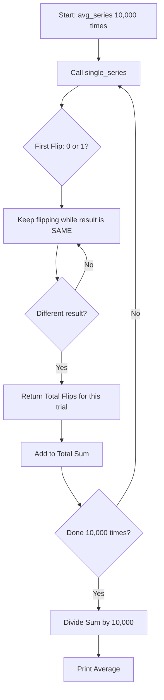

```mermaid
graph TD
    A[Start: avg_series 10,000 times] --> B[Call single_series]
    B --> C{First Flip: 0 or 1?}
    C --> D[Keep flipping while result is SAME]
    D --> E{Different result?}
    E -- No --> D
    E -- Yes --> F[Return Total Flips for this trial]
    F --> G[Add to Total Sum]
    G --> H{Done 10,000 times?}
    H -- No --> B
    H -- Yes --> I[Divide Sum by 10,000]
    I --> J[Print Average]
```